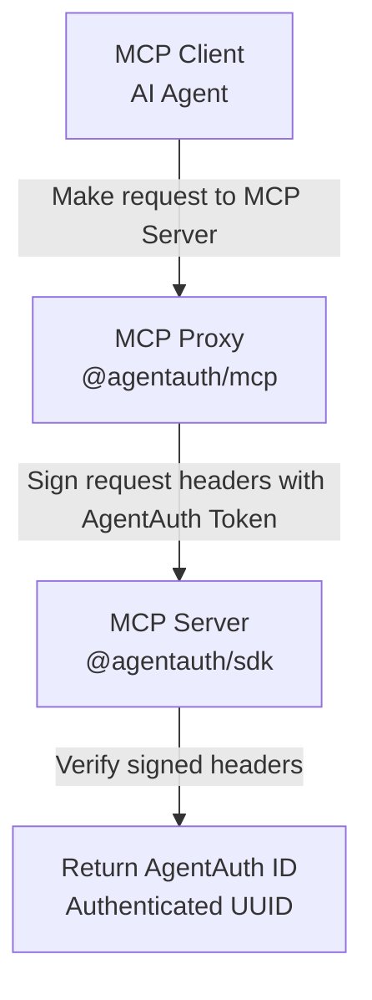

# AgentAuth: Self-Authenticating IDs for AI Agents

[](https://www.npmjs.com/package/@agentauth/core)
[](https://www.npmjs.com/package/@agentauth/core)
[](https://opensource.org/licenses/MIT)
[](https://github.com/agentcorelabs/agentauth)

Give any agent an `AgentAuth ID` — a stable, unique, verifiable UUID — and the power to authenticate using it, with no logins, accounts, or sessions required.

**AgentAuth** redefines agent identity: no emails or usernames, no accounts or wallets, no centralized trust layers. Just a single, lightweight ID that delivers identity and trust, designed for native use with MCP.

## 🔥 Why AgentAuth?

- **Purpose-built for AI agents** — Easy to generate and manage, no user accounts needed
- **Works across any MCP server** — Universal, stable, and designed for use with agent-native communication protocols like MCP
- **No extra infra** — Zero backend needed for auth — just drop in the SDK

## 🚀 Quick Start

### For AI Agent Users

1. **Generate your agent's `AgentAuth Token`:**
   ```bash
   npm install -g @agentauth/mcp
   agentauth-mcp generate
   # Output: AGENTAUTH_TOKEN=aa-...
   ```

The `AgentAuth Token` is like the password for a corresponding `AgentAuth ID` -- and, since the `AgentAuth Token` can be used to derive the `AgentAuth ID`, it's all you need to include in your configuration!

⚠️ Note: Just like any password, please remember to store your `AgentAuth Token` **SECURELY** and never share it with anyone, as it is used to authenticate your agent.

2. **Add it to your MCP client config (e.g. Claude, Cursor, Windsurf):**
   ```json
   {
     "mcpServers": {
       "my-server": {
         "command": "agentauth-mcp",
         "args": ["connect", "https://example.com/mcp"],
         "env": {
           "AGENTAUTH_TOKEN": "aa-..."
         }
       }
     }
   }
   ```

Since your agent's `AgentAuth Token` is stable and unique, it can be reused across **any** MCP server using AgentAuth — so when adding a new server, all you need to do is update the `connect` URL, then set once and forget!

⚠️ Note: The `AgentAuth Token` is only ever used **LOCALLY** by the @agentauth/mcp package, and never sent to the MCP server. The server only receives the `AgentAuth ID` and verification that you have the `AgentAuth Token`.

### For MCP Server Developers

1. **Install the `@agentauth/sdk` package in your project**

```bash
# Add to your MCP server
npm install @agentauth/sdk
```

2. **Identify and Authenticate agents anywhere in your code**

AgentAuth's SDK makes it easy to identify and authenticate agents anywhere in your code -- whether that's at the initial connection (e.g. somewhere in middleware to reject unauthenticated agents), or in the middle of a tool call (e.g. to return different results for authenticated and unauthenticated users).

All you need to do is use the SDK's `verify` method to retrieve the verified **AgentAuth ID** -- a stable, unique UUID -- for that agent and you can rest assured that the request is coming from the controller of that `AgentAuth ID`.

Here is a simple example showing how to use `verify` to identify and authenticate an agent during a tool call:

```typescript
import { McpServer } from '@modelcontextprotocol/sdk/server/mcp.js';
import { verify } from '@agentauth/sdk';

const server = new McpServer({ name: "my-server", version: "1.0.0" });

// Any tool can check authentication
server.tool("premium-feature", "Premium tool with auth", {}, async () => {
  // Replace `getRequestHeaders` with however your transport exposes HTTP headers
  const authResult = verify({ headers: getRequestHeaders() });
  
  if (authResult.valid) {
    // Store the UUID in your database!
    const agentId = authResult.agentauth_id;
    return { content: [{ type: "text", text: `Premium access granted! Agent ID: ${agentId}` }] };
  }
  
  return { content: [{ type: "text", text: "🔒 This feature requires authentication" }] };
});
```

## ✨ Key Features

- **🆔 Self-Authenticating IDs** - Each `AgentAuth Token` generates *both* a stable UUID (`AgentAuth ID`) and authentication capability
- **⚡ Single Token Flow** - For MCP client users, `AgentAuth Token` provides complete identity + auth
- **🔐 Zero Infrastructure** - For MCP server devs, no accounts, logins, or session management infra required
- **🗄️ Database-Ready UUID** - Store and use `AgentAuth ID` immediately, no extra steps
- **🔧 MCP-Native** - Built specifically for communication over MCP specs

## 📦 AgentAuth Packages Overview

**Where to start:**
- **MCP Client Users:** Use [`@agentauth/mcp`](./packages/agentauth-mcp) to connect any MCP client to any remote MCP server, with universal auth support
- **MCP Server Developers:** Use [`@agentauth/sdk`](./packages/agentauth-sdk) to easily add MCP-native authentication to your servers
- **Advanced Users:** Read [`@agentauth/core`](./packages/agentauth-core) to understand the underlying identity primitives and design decisions

| Package | Description | Install | Docs |
|---------|-------------|---------|------|
| **[@agentauth/mcp](./packages/agentauth-mcp)** | Universal MCP proxy - connect any client to any remote server, with or without authentication | `npm install -g @agentauth/mcp` | [📖 README](./packages/agentauth-mcp/README.md) |
| **[@agentauth/sdk](./packages/agentauth-sdk)** | Server-side SDK - add MCP-native authentication to your servers with one function call | `npm install @agentauth/sdk` | [📖 README](./packages/agentauth-sdk/README.md) |
| **[@agentauth/core](./packages/agentauth-core)** | Core identity primitives - identity generation, signing, and verification using cryptography | (Auto-installed) | [📖 README](./packages/agentauth-core/README.md) |

**Additional resources for MCP Server developers:**
- **[Working Example](./examples/weather-server/)** - Complete example with tiered authentication, dual transport support, and real-world integration patterns
- **[End-to-End Tests](./tests/e2e/)** - Comprehensive test scenarios demonstrating authentication flows and MCP client integration
- **[Unit Tests](./packages/)** - Individual package tests located in each `src/` directory for detailed API testing
- **[Testing Guide](./TESTING.md)** - Testing guide 

## 🏗️ How AgentAuth Works

1. **One Token**: Generate a single `AgentAuth Token`
2. **Automatic Identity**: Token derives an `AgentAuth ID` (a stable, verifiable UUID)
3. **Self-Authentication**: Every request includes verifiable proof
4. **Instant Verification**: Servers verify and extract the `AgentAuth ID` in one step
5. **Ready to Use**: Use the `AgentAuth ID` immediately in your database

No additional steps. No account creation. No session management.

**Technical Flow**



## 🎯 Use Cases

- **Premium MCP Tools** - Offer authenticated features alongside free tiers
- **Usage Tracking** - Monitor agent activity with stable, anonymous IDs
- **Access Control** - Implement tool-level permissions and rate limiting  
- **Analytics** - Understand agent behavior without compromising privacy

## 🚀 Getting Started

### MCP Client Configuration

As an MCP client user, you will be using the [`@agentauth/mcp`](./packages/agentauth-mcp) package. See the README there for more details.

1. Generate credentials:
   ```bash
   npm install -g @agentauth/mcp
   agentauth-mcp generate
   # Output: AGENTAUTH_TOKEN=aa-...
   ```

The `generate` command generates a unique `AgentAuth Token` (starts with `aa-`) for your agent.

The `AgentAuth Token` is like the password for a corresponding `AgentAuth ID` -- and, since the `AgentAuth Token` is used to derive the `AgentAuth ID`, it's all you need to include in your configuration for both identity and auth!

⚠️ Notes:
- Store your `AgentAuth Token` immediately, as it will only be shown to you once (per use of `generate`)
- Just like any password, please remember to store your `AgentAuth Token` **SECURELY**, as it is used to authenticate your agent
- You can check your corresponding `AgentAuth ID` anytime using `derive <AgentAuth Token>`:
   ```bash
   agentauth-mcp derive aa-...
   # Output: AGENTAUTH_ID=...
   ```

2. Add it to your MCP client configuration file:
   ```json
   {
     "mcpServers": {
       "my-server": {
         "command": "agentauth-mcp",
         "args": ["connect", "https://example.com/mcp"],
         "env": {
           "AGENTAUTH_TOKEN": "aa-..."
         }
       }
     }
   }
   ```

The `@agentauth/mcp` proxy is designed to be your universal, long-term proxy for **ALL** remote MCP server connections. This means that:
- Once added, you can keep this configuration the same for as long as you use the MCP server
- You can use the same configuration for **any remote MCP** server, even ones that don't use AgentAuth
- You can safely use the same `AgentAuth Token` when connecting to **any** MCP server that uses AgentAuth
- Basically, all you need to do is copy and paste the same config for every new remote MCP server you want to connect to (just update the URL after `connect`)!

⚠️ Notes:
- The `AgentAuth Token` is only ever used **LOCALLY** by the @agentauth/mcp package, and **NEVER** sent to the MCP server
- Servers only receive the `AgentAuth ID` and verification that you have the `AgentAuth Token`

### MCP Server Integration

As an MCP server developer, you will want to install and import the [`@agentauth/sdk`](./packages/agentauth-sdk) package. See the README there for more details.

**Authenticating Requests**
The key method is `verify()`, which takes request headers and returns the **verified AgentAuth UUID** of the agent if the request is properly authenticated.

This means that you can authenticate requests on the fly without requiring any *a priori* "login" in the traditional sense, making the communication process much more streamlined and MCP-native.
- **Requests** - You can authenticate requests at any point — on connect, during tool calls, or inline.
- **Connections** - You can authenticate connections immediately (e.g. in middleware) using the incoming HTTP headers and identify the authenticated agent
- **Tool calls** - You can authenticate at the beginning of a tool call, or even in middle of a tool call to provide different responses depending on authentication status

**AgentAuth UUID**
Moreover, the AgentAuth UUID is a stable UUID for any given agent, derived from its AgentAuth Token (generated on the client-side), giving it a long-term, universal *identity*.

This means that you can simply and safely treat the UUID returned by `verify` as an **authenticated user of your service** — just like a user ID. For example:
- **Create** - Create an entry in your DB to identify the agent using its `AgentAuth ID` (e.g. for first-time users).
- **Retrieve** - Retrieve the agent in your DB using its `AgentAuth ID` to read or update properties (e.g. for return users).
- **Forward** - Forward the `AgentAuth ID` to third-party services to request additional information or permissions for the agent.

Here is a simple example implementation:

```typescript
import { McpServer } from '@modelcontextprotocol/sdk/server/mcp.js';
import { verify } from '@agentauth/sdk';
import { z } from 'zod';

const server = new McpServer({ name: "my-server", version: "1.0.0" });

// Helper to get auth context
function getAuthContext() {
  // Replace with how your transport exposes HTTP headers
  const authResult = verify({ headers: getCurrentRequestHeaders() });
  return authResult.valid ? authResult : null;
}

// Free tool - enhanced for authenticated users
server.tool(
  "get-data",
  "Get data (more for authenticated users)",
  { query: z.string() },
  async ({ query }) => {
    const auth = getAuthContext();
    
    if (auth) {
      // Store/log the agent UUID for analytics!
      console.log(`Agent ${auth.agentauth_id} requested: ${query}`);
      return { 
        content: [{ 
          type: "text", 
          text: `Premium data for agent ${auth.agentauth_id.slice(0, 8)}...` 
        }] 
      };
    }
    
    return { content: [{ type: "text", text: "Basic data (authenticate for more!)" }] };
  }
);

// Premium tool - requires authentication
server.tool(
  "premium-feature",
  "Access premium features (requires auth)",
  {},
  async () => {
    const auth = getAuthContext();
    
    if (!auth) {
      return { 
        content: [{ 
          type: "text", 
          text: "🔒 Premium feature requires authentication.\nGenerate credentials: `agentauth-mcp generate`" 
        }] 
      };
    }
    
    // Use the stable UUID for user-specific features
    const agentId = auth.agentauth_id;
    // Query your database, track usage, etc.
    
    return { content: [{ type: "text", text: `Premium access granted for ${agentId}!` }] };
  }
);
```

## 🔒 Security Features

- **`AgentAuth Token` never leaves your machine** - Only used locally and only stored in your local config
- **Derived identity** - Only your derived `AgentAuth ID` is shared with servers, never tokens
- **Timestamp-based replay protection** - 60-second window prevents replay attacks  
- **Cryptographic signatures** - Every request is signed with your `AgentAuth Token`
- **No server-side state required** - Completely stateless verification

## 🛠️ Development

**Fresh repository clone setup:**

```bash
# Clone the repository
git clone https://github.com/agentcorelabs/agentauth.git
cd agentauth

# Install all workspace dependencies (packages, examples, tests)
pnpm install

# Build all packages (required before running examples/tests)
pnpm run build

# Run all package unit tests
pnpm test

# Run e2e integration tests
cd tests/e2e && pnpm test

# Run the example weather server
cd examples/weather-server && pnpm run start  # Starts the weather server at http://localhost:8000/mcp using HTTP by default
```

**Note:** This is a pnpm workspace project. All examples and tests use `workspace:*` dependencies, requiring pnpm for installation and development.

## 📚 Documentation

**Package Documentation:**
- **[@agentauth/mcp README](./packages/agentauth-mcp/README.md)** - Universal MCP proxy for connecting clients to remote servers
- **[@agentauth/sdk README](./packages/agentauth-sdk/README.md)** - Server-side SDK for adding MCP-native authentication
- **[@agentauth/core README](./packages/agentauth-core/README.md)** - Core identity primitives and cryptographic functions

**Examples and Testing:**
- **[Working Example](./examples/weather-server/README.md)** - Complete weather server with tiered authentication
- **[Testing Guide](./TESTING.md)** - Comprehensive development and testing documentation
- **[Tests Directory](./tests/README.md)** - Overview of test structure and quick start commands

**External Resources:**
- **[Documentation Site](https://docs.agentauth.co)** - Complete API reference and guides

## 🤝 Contributing

AgentAuth is an early-stage open-source project maintained by the AgentCore Labs team. We welcome bug reports, feature suggestions, and early feedback via [GitHub Issues](https://github.com/agentcorelabs/agentauth/issues). You can also reach out at [developers@agentcore.me](mailto:developers@agentcore.me?subject=Contributing%20to%20AgentAuth) if you are interested in contributing.

## 📄 License

MIT License - see [LICENSE](LICENSE) for details.

## 🔗 Links

- **Website**: [agentauth.co](https://agentauth.co)
- **Documentation**: [docs.agentauth.co](https://docs.agentauth.co)  
- **npm**: [@agentauth](https://www.npmjs.com/org/agentauth)
- **Issues**: [GitHub Issues](https://github.com/agentcorelabs/agentauth/issues)

---

**Built by [AgentCore Labs](https://agentcore.me)** - Advancing the frontier of AI agent infrastructure.