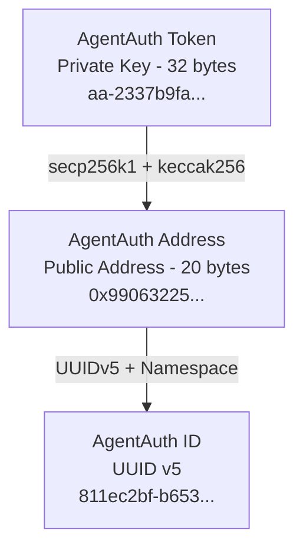
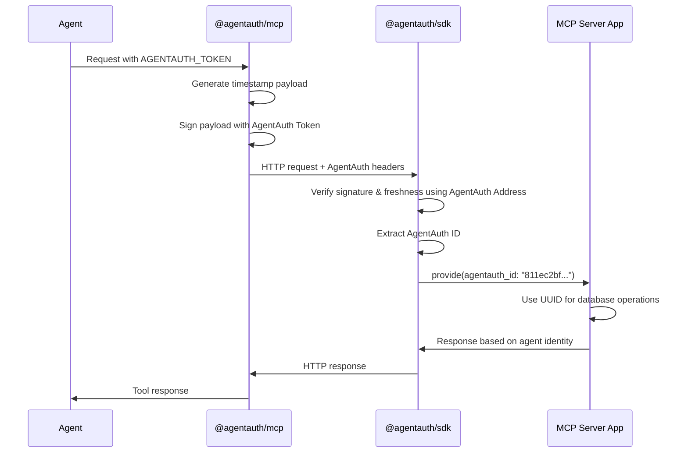

# @agentauth/core: Core Identity and Cryptographic Primitives for AgentAuth

[](https://www.npmjs.com/package/@agentauth/core)
[](https://www.npmjs.com/package/@agentauth/core)
[](https://www.npmjs.com/package/@agentauth/core)
[](https://opensource.org/licenses/MIT)
[](https://github.com/agentcorelabs/agentauth)

Core identity primitive and cryptographic components for **AgentAuth** — a self-authenticating identity system for AI agents.

This package provides the low-level cryptographic foundation used by the AgentAuth ecosystem. It handles key generation, address derivation, signing, and verification using secp256k1 elliptic curve cryptography.

Learn more about AgentAuth at https://github.com/agentcorelabs/agentauth.

## Why @agentauth/core?

- **🔑 Complete Identity System** — Generate stable agent identities with one function call
- **🔐 Industry-standard Cryptography** — Uses secp256k1 and battle-tested industry standards throughout
- **🆔 Deterministic UUIDs** — Same private key always generates the same UUID
- **✍️ Sign & Verify** — Simple payload signing and verification for authentication flows
- **🛡️ Minimal, Well-Audited Dependencies** — Built on Noble cryptographic libraries, UUID, and nothing else

## Installation

```bash
npm install @agentauth/core
```

## Quick Start

### Generate a New Identity

Create a complete AgentAuth identity with one function call:

```typescript
import { generateIdentity } from '@agentauth/core';

const identity = generateIdentity();
console.log(identity);
// {
//   agentauth_token: 'aa-2337b9fa957a201db466a58065529dc40362e008d3f41655651b96b2abbcb602',
//   agentauth_address: '0x9906322508aa2d8cbf24c33751015162d58285ce',
//   agentauth_id: '811ec2bf-b653-573a-b2ea-6ff4df9fdad7'
// }
```

The identity includes:
- `agentauth_token`: The private key (with aa- prefix) — ⚠️ keep this secret!
- `agentauth_address`: An industry-standard address derived from `agentauth_token`, used for verification
- `agentauth_id`: A stable UUID v5 derived from `agentauth_address`

> [!TIP]
> As you can see, all you actually need to re-derive the full identity primitive is the `agentauth_token`, which makes it super lightweight!

> [!IMPORTANT]
> That's also why it's so important to protect it during usage (e.g. by only using it locally), and for users to store it **SECURELY**!

### Work with Existing Keys

Derive address and ID from an existing private key:

```typescript
import { deriveAddress, generateId } from '@agentauth/core';

// Accepts any format: aa-, 0x, or raw hex
const privateKey = 'aa-2337b9fa957a201db466a58065529dc40362e008d3f41655651b96b2abbcb602';

const address = deriveAddress(privateKey);
const id = generateId(address);

console.log(address); // '0x9906322508aa2d8cbf24c33751015162d58285ce'
console.log(id);      // '811ec2bf-b653-573a-b2ea-6ff4df9fdad7'
```

### Sign and Verify Payloads

Use for authentication flows and message signing:

```typescript
import { signPayload, verifySignature } from '@agentauth/core';

const payload = {
  timestamp: new Date().toISOString(),
  action: 'authenticate',
  data: { tool: 'weather-forecast' }
};

// Sign with private key
const signature = signPayload(payload, privateKey);

// Verify with address
const isValid = verifySignature(signature, payload, address);
console.log(isValid); // true
```

## Identity Primitive

The AgentAuth identity primitive consists of three components that work together to provide a complete, self-contained identity system. Each component serves a specific purpose and was chosen for both technical and practical reasons.

### AgentAuth Token (`agentauth_token`)

**What it is:** A secp256k1 private key with an `aa-` prefix, formatted as 64 characters of hex, used for signing and authentication.

```
Format: aa-[64 hex characters]
Example: aa-2337b9fa957a201db466a58065529dc40362e008d3f41655651b96b2abbcb602
```

**Why we chose this design:**

- **Battle-tested cryptography:** Uses the same secp256k1 curve and key derivation as Bitcoin and Ethereum, securing billions of dollars in value
- **Industry standard:** Developers already understand this format and its security properties, with many well-audited, compatible libraries
- **Self-contained:** The token alone is sufficient to derive the complete identity
- **Recognizable prefix:** The `aa-` prefix makes AgentAuth tokens immediately identifiable and prevents accidental mixing with other key formats
- **Future compatibility:** Uses Bitcoin/Ethereum-compatible formats, enabling integration with existing cryptographic tooling

**Security properties:**
- 256 bits of entropy (same security level as Bitcoin/Ethereum private keys)
- Generated using cryptographically secure random number generation
- Should be treated like any private key: keep secret, store securely

We use [@noble/secp256k1](https://github.com/paulmillr/noble-secp256k1) for all cryptographic operations, chosen for its audit history and constant-time implementations.

> [!NOTE]
> While AgentAuth currently uses secp256k1 for its default identity system — chosen for its ecosystem maturity, developer familiarity, and audit-backed performance — future versions of AgentAuth will **also** support Ed25519-based tokens for broader cryptographic interoperability and enhanced performance characteristics.

### AgentAuth Address (`agentauth_address`)

**What it is:** A cryptographically stable and secure address derived from the private key using keccak256 derivation, used for signature verification

```
Format: 0x[40 hex characters]
Example: 0x9906322508aa2d8cbf24c33751015162d58285ce
```

**Why we chose this design:**

- **Verification-ready:** Servers can verify signatures using the same battle-tested algorithms as Ethereum (ecrecover)
- **Standard format:** 20-byte Ethereum/EVM-style addresses are well-understood by developers and ergonomic for users
- **Tool compatibility:** Works with existing development tools and libraries for testing and debugging
- **Efficient performance:** Enables efficient signature verification using proven ecrecover algorithms
- **Future extensibility:** Uses Ethereum/EVM-compatible address format, enabling potential integrations without breaking changes

**Role in the system:**
- Used for cryptographic verification of signed payloads
- Never sent alone—always accompanied by a signature proving ownership
- Derived deterministically from the private key (same key = same address)

The derivation follows Ethereum's address derivation: keccak256(publicKey)[12:] where publicKey is the uncompressed secp256k1 public key.

### AgentAuth ID (`agentauth_id`)

**What it is:** A UUID v5 generated deterministically from the AgentAuth Address, used for stable identification across systems

```
Format: [UUID v5]
Example: 811ec2bf-b653-573a-b2ea-6ff4df9fdad7
```

**Why we chose this design:**

- **Database-friendly:** UUIDs are a standard, well-supported identifier format
- **Deterministic:** Same address always produces the same UUID
- **Globally unique:** UUID v5 guarantees uniqueness across all systems
- **Privacy-preserving:** Doesn't directly expose the cryptographic address
- **Application-ready:** Perfect for use as primary keys, user IDs, and foreign keys

**Role in the system:**
- The stable, public identifier used by applications
- Safe to store in databases, logs, and APIs
- Enables user recognition across different MCP servers
- Generated using a fixed namespace UUID to ensure consistency

We use a fixed, custom namespace UUID (`2f5a5c48-c283-4231-8975-9271fe11e86c`) to derive all AgentAuth UUIDs to ensure they are all unique and stable.

## How AgentAuth Works

Understanding how AgentAuth works with this library under the hood helps explain why it's both secure and simple. The system is built on four key processes that utilize this library, in conjunction with the identity primitive above.

### Identity Generation Process

When you call `generateIdentity()`, here's what happens:

**1. Secure randomness:** We generate 32 bytes (256 bits) of cryptographically secure random data using the platform's secure random number generator.

**2. Private key formatting:** The random bytes are encoded as hex and prefixed with `aa-` to create the AgentAuth Token.

**3. Deterministic derivation:** The address and UUID are derived using the processes below.

```typescript
// Simplified conceptual flow
const randomBytes = secureRandom(32);           // 256 bits of entropy
const privateKey = 'aa-' + toHex(randomBytes);  // Format as AgentAuth Token
const address = deriveAddress(privateKey);      // Ethereum-style derivation
const uuid = generateId(address);               // UUID v5 generation
```

**Why this approach:**
- **Maximum entropy:** Uses platform secure randomness for unpredictability
- **No server dependency:** Identity generation works completely offline
- **Deterministic rebuild:** The complete identity can be reconstructed from just the token

### Primitive Derivation Process

The identity primitive's three components are mathematically related through a deterministic chain:



**Token → Address derivation:**
1. Remove `aa-` prefix and convert hex to bytes
2. Generate secp256k1 public key from private key ([handled by @noble/secp256k1](https://github.com/paulmillr/noble-secp256k1))
3. Apply keccak256 hash to the uncompressed public key
4. Take the last 20 bytes and format with `0x` prefix

**Address → UUID derivation:**
1. Use the address as input to UUID v5 generation
2. Apply our fixed namespace UUID (`2f5a5c48-c283-4231-8975-9271fe11e86c`)
3. Generate deterministic UUID following [RFC 4122](https://tools.ietf.org/html/rfc4122)

**Why deterministic derivation:**
- **Reproducible:** Same token always generates the same address and UUID
- **Stateless:** No need to store mappings between primitives
- **Verifiable:** Anyone can verify the relationships between primitives

### Authentication Signature Process

When an agent needs to authenticate (e.g., via @agentauth/mcp), here's the signature flow:

**1. Payload construction:** Create a JSON object with timestamp
```typescript
const payload = {
  timestamp: '2024-01-15T10:30:00.000Z'
};
```

**2. Canonical JSON:** Convert to deterministic string representation
```typescript
const message = JSON.stringify(payload);  // Must be deterministic
```

**3. Signature generation:** Sign the message using ECDSA
- Hash the message with keccak256
- Sign the hash using secp256k1 ECDSA ([handled by @noble/secp256k1](https://github.com/paulmillr/noble-secp256k1))
- Format as hex with recovery bit

**4. Header transmission:** Send via HTTP headers
- `x-agentauth-address`: The AgentAuth Address
- `x-agentauth-signature`: The signature with `0x` prefix
- `x-agentauth-payload`: Base64-encoded JSON payload

**Why this design:**
- **Standard cryptography:** Uses well-understood ECDSA signatures
- **Stateless replay protection:** Timestamp provides replay protection without requiring stateful nonce storage (e.g. by the server)
- **Efficient verification:** Verify without storing state or tracking used nonces
- **HTTP compatible:** Works with standard HTTP header mechanisms

**Note on nonces:** We deliberately chose timestamp-based replay protection over nonces to maintain statelessness:
- Nonces would require servers to track used values, adding complexity and storage requirements
- A freshness window provides adequate replay protection for most use cases while keeping verification completely stateless
- Future versions of @agentauth/mcp and @agentauth/sdk may add optional nonce support for applications requiring additional stateful security measures
- It's also worth noting that the @agentauth/core library itself is designed for maximum flexibility and is **unopinionated** about the payloads it signs

**Industry precedent:** Timestamp-based authentication windows are widely used across the industry:
- **AWS Signature V4:** 15-minute default window for signed requests
- **Google Cloud APIs:** 15-minute window for OAuth token timestamps  
- **JWT tokens:** Configurable `exp` and `nbf` claims for time-based validation
- **OAuth 2.0:** Timestamp validation in bearer token flows
- **HMAC-based APIs:** Common pattern with 5-15 minute windows

Our 60-second default strikes a balance between security (shorter than most) and practical network/clock tolerance.

### Server Verification Process

When an MCP server receives a request (e.g., via @agentauth/sdk), here's the verification flow:

**1. Header extraction:** Parse the three AgentAuth headers
```typescript
const address = headers['x-agentauth-address'];     // 0x99063225...
const signature = headers['x-agentauth-signature']; // 0x1234abcd...
const payload = base64Decode(headers['x-agentauth-payload']);
```

**2. Signature verification:** Verify the signature matches the payload and address
- Decode the base64 payload back to JSON
- Hash the JSON string with keccak256
- Use ecrecover to extract the signing address from the signature
- Compare recovered address with provided address

**3. Freshness check:** Ensure the request is recent
```typescript
const payloadObj = JSON.parse(payload);
const timestamp = new Date(payloadObj.timestamp);
const now = new Date();
const isRecent = (now - timestamp) < 60000;  // 60 second default window
```

**Configurable freshness window:** The 60-second window is configurable via the `VerifyOptions` parameter:
```typescript
// Default 60-second window
const result = verify({ headers });

// Custom 2-minute window for high-latency networks
const result = verify({ headers }, { freshness: 120000 });

// Stricter 30-second window for high-security applications  
const result = verify({ headers }, { freshness: 30000 });
```

This flexibility allows applications to adjust based on their network conditions, security requirements, and clock synchronization tolerance. Most applications can use the 60-second default, which is more conservative than industry standards (AWS: 15 minutes, Google: 15 minutes) while accommodating typical network latency and clock drift.

**4. Identity extraction:** Generate the AgentAuth ID
```typescript
if (signatureValid && isRecent) {
  const agentId = generateId(address);  // Deterministic UUID generation
  // Agent authenticated! Use agentId as user identifier
}
```

**Why this approach:**
- **Stateless verification:** No server-side session storage needed
- **Standard cryptography:** Uses proven signature verification techniques
- **Replay protection:** Timestamp validation prevents old requests
- **Immediate identity:** Can extract stable UUID for database use

### Complete Authentication Flow

Here's how all the pieces work together in a real authentication scenario:



This end-to-end flow ensures that:
- Agents never send private keys over the network
- Servers get a stable, verified identity for each agent
- No centralized auth service is required
- The system works entirely over standard HTTP

## API Reference

### `generateIdentity(algorithm?: Algorithm)`

Generates a complete AgentAuth identity including private key, address, and deterministic ID.

**Parameters:**
- `algorithm`: Currently only supports `'secp256k1'` (default)

**Returns:**
```typescript
{
  agentauth_token: string;   // Private key with aa- prefix
  agentauth_address: string; // Ethereum-compatible address with 0x prefix
  agentauth_id: string;      // UUID v5
}
```

**Example:**
```typescript
const identity = generateIdentity();
// Store identity.agentauth_token securely!
// Use identity.agentauth_id as the public identifier
```

### `deriveAddress(privateKey: string)`

Derives an Ethereum-compatible address from a private key.

**Parameters:**
- `privateKey`: Private key in any format (aa-, 0x, or raw hex)

**Returns:**
- Ethereum-compatible address with 0x prefix (20 bytes)

**Example:**
```typescript
const address = deriveAddress('aa-2337...');
// '0x9906322508aa2d8cbf24c33751015162d58285ce'
```

### `generateId(address: string)`

Generates a deterministic UUID v5 from an address.

**Parameters:**
- `address`: Ethereum-compatible address (0x-prefixed)

**Returns:**
- UUID v5 string

**Example:**
```typescript
const id = generateId('0x9906322508aa2d8cbf24c33751015162d58285ce');
// '811ec2bf-b653-573a-b2ea-6ff4df9fdad7'
```

### `signPayload(payload: object, privateKey: string)`

Signs a JSON payload using a private key.

**Parameters:**
- `payload`: JSON object to sign
- `privateKey`: Private key in any format

**Returns:**
- Hex-encoded signature with 0x prefix (65 bytes)

**Example:**
```typescript
const signature = signPayload({ msg: 'hello' }, privateKey);
// '0x1234...abcd'
```

### `verifySignature(signature: string, payload: object, expectedAddress: string)`

Verifies a signature against a payload and expected address.

**Parameters:**
- `signature`: Hex-encoded signature with 0x prefix
- `payload`: Original JSON payload
- `expectedAddress`: Expected Ethereum-compatible address

**Returns:**
- Boolean indicating validity

**Example:**
```typescript
const isValid = verifySignature(signature, payload, address);
// true
```

### `parsePrivateKey(token: string)`

Utility function to parse private keys from any supported format.

**Parameters:**
- `token`: Private key with aa-, 0x, or no prefix

**Returns:**
- Clean 32-byte hex string (64 characters)

**Example:**
```typescript
parsePrivateKey('aa-2337...');  // '2337...'
parsePrivateKey('0x2337...');   // '2337...'
parsePrivateKey('2337...');     // '2337...'
```

## Common Patterns

### Identity Storage

Store only what you need:

```typescript
// For servers: Store the UUID as user identifier
const identity = generateIdentity();
await db.users.create({
  id: identity.agentauth_id,
  created: new Date()
});

// For clients: Store the private key securely
const identity = generateIdentity();
await secureStorage.set('agentauth_token', identity.agentauth_token);
```

### Authentication Flow

Build a simple authentication system:

```typescript
// Client side: Sign authentication request
const authPayload = {
  timestamp: new Date().toISOString()
};
const signature = signPayload(authPayload, privateKey);
const address = deriveAddress(privateKey);

// Send to server: { address, signature, payload: authPayload }

// Server side: Verify and extract ID
const isValid = verifySignature(signature, authPayload, address);
if (isValid) {
  const agentId = generateId(address);
  // Authenticated! Use agentId as user identifier
}
```

### Key Format Handling

The library accepts multiple key formats for compatibility:

```typescript
// All these are equivalent
const key1 = 'aa-2337b9fa957a201db466a58065529dc40362e008d3f41655651b96b2abbcb602';
const key2 = '0x2337b9fa957a201db466a58065529dc40362e008d3f41655651b96b2abbcb602';
const key3 = '2337b9fa957a201db466a58065529dc40362e008d3f41655651b96b2abbcb602';

// All will produce the same address
deriveAddress(key1) === deriveAddress(key2) === deriveAddress(key3);
```

## Security Notes

- **Private keys** (`agentauth_token`) should be kept secret and stored securely
- **Deterministic generation** means same private key always produces same ID
- **No random salts** in signatures — include timestamp in payload for replay protection
- **Ethereum compatibility** allows integration with existing Ethereum development tools for testing and debugging
- **Noble libraries** provide audited, constant-time implementations

## TypeScript Support

Full TypeScript support with exported types:

```typescript
import type { Algorithm } from '@agentauth/core';

// Currently only 'secp256k1' is supported
const algo: Algorithm = 'secp256k1';
```

## Testing

Run the test suite:

```bash
npm test
```

## Contributing

AgentAuth is an early-stage open-source project maintained by the AgentCore Labs team. We welcome bug reports, feature suggestions, and early feedback via [GitHub Issues](https://github.com/agentcorelabs/agentauth/issues). You can also reach out at [developers@agentcore.me](mailto:developers@agentcore.me?subject=Contributing%20to%20AgentAuth) if you are interested in contributing.

## License

MIT License — see [LICENSE](https://github.com/agentcorelabs/agentauth/blob/main/LICENSE) for details.

## Links

- **Website** — [agentauth.co](https://agentauth.co)
- **Documentation** — [docs.agentauth.co](https://docs.agentauth.co)  
- **GitHub** — [agentcorelabs/agentauth](https://github.com/agentcorelabs/agentauth)
- **npm** — [@agentauth/core](https://www.npmjs.com/package/@agentauth/core)

---

**Built by [AgentCore Labs](https://agentcore.me)** — Advancing the frontier of AI agent infrastructure.
