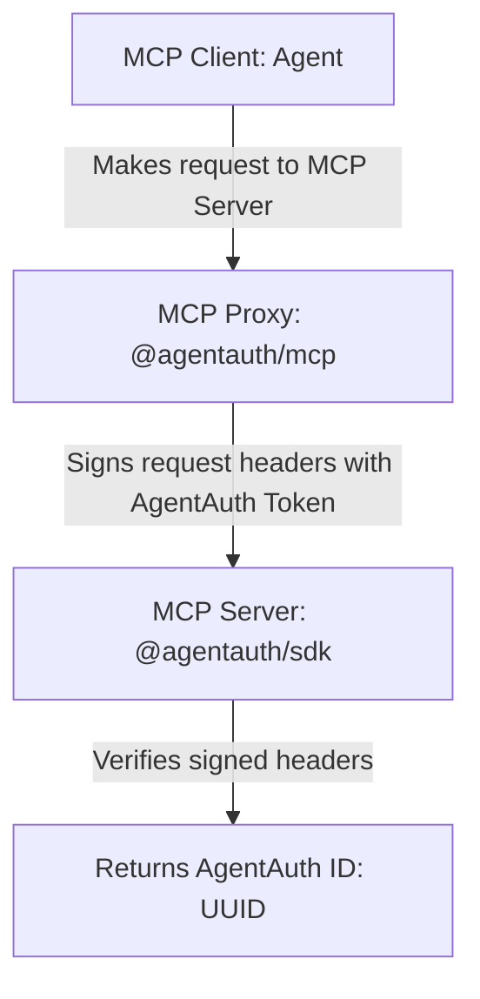

# @agentauth/sdk: MCP-Native Server-Side Authentication for AI Agents

[](https://www.npmjs.com/package/@agentauth/sdk)
[](https://www.npmjs.com/package/@agentauth/sdk)
[](https://www.npmjs.com/package/@agentauth/sdk)
[](https://opensource.org/licenses/MIT)
[](https://github.com/agentcorelabs/agentauth)

Server SDK for **AgentAuth** — authenticate AI agents with self-authenticating IDs over MCP.

AgentAuth gives any agent an `AgentAuth ID` — a stable, unique, verifiable UUID — and the power to authenticate using it, with no logins, accounts, or sessions required.

AgentAuth redefines agent identity: no emails or usernames, no accounts or wallets, no centralized trust layers. Just a single, lightweight ID that delivers identity and trust, designed for native use with MCP.

Learn more about AgentAuth at https://github.com/agentcorelabs/agentauth.

## Why @agentauth/sdk?

- **🔥 Simplest Server-side Usage** — Absolutely the simplest server-side implementation: a single UUID to identify, a single call to verify
- **🔐 Zero Infrastructure** — No accounts, logins, or session management required
- **🆔 Stable Agent IDs** — Each agent has its own `AgentAuth ID`, a permanent, verifiable UUID you can use immediately
- **⚡ Stateless Verification** — One function call to authenticate any request
- **🛡️ Cryptographically Secure** — Based on industry-standard signatures with replay protection
- **🔧 Framework Agnostic** — Works with any MCP server, or even any HTTP server

## Installation

```bash
npm install @agentauth/sdk
```

## Quick Start

### Basic Usage

The SDK provides a single `verify` function that authenticates requests and returns the agent's stable UUID:

```typescript
import { verify } from '@agentauth/sdk';

// In your request handler
const result = verify({ headers: request.headers });

if (result.valid) {
  const agentId = result.agentauth_id;  // Stable UUID for this agent
  console.log(`Authenticated agent: ${agentId}`);
  // Grant access, track usage, personalize response...
} else {
  console.log('No valid authentication');
  // Provide limited access or deny request...
}
```

### MCP Server Integration

Here's how to add AgentAuth to your MCP server:

```typescript
import { McpServer } from '@modelcontextprotocol/sdk/server/mcp.js';
import { verify } from '@agentauth/sdk';
import { z } from 'zod';

const server = new McpServer({ name: "my-server", version: "1.0.0" });

// Helper to get auth context from your transport
function getAuthContext() {
  // Replace with how your transport exposes HTTP headers
  const headers = getCurrentRequestHeaders();
  const authResult = verify({ headers });
  return authResult.valid ? authResult : null;
}

// Free tool - enhanced for authenticated users
server.tool(
  "get-data",
  "Get data (more for authenticated users)",
  { query: z.string() },
  async ({ query }) => {
    const auth = getAuthContext();
    
    if (auth) {
      // Use the stable UUID for user-specific features
      console.log(`Agent ${auth.agentauth_id} requested: ${query}`);
      return { 
        content: [{ 
          type: "text", 
          text: `Premium data for agent ${auth.agentauth_id.slice(0, 8)}...` 
        }] 
      };
    }
    
    return { content: [{ type: "text", text: "Basic data (authenticate for more!)" }] };
  }
);

// Premium tool - requires authentication
server.tool(
  "premium-feature",
  "Access premium features (requires auth)",
  {},
  async () => {
    const auth = getAuthContext();
    
    if (!auth) {
      return { 
        content: [{ 
          type: "text", 
          text: "🔒 Premium feature requires authentication.\nGenerate credentials: `agentauth-mcp generate`" 
        }] 
      };
    }
    
    // Use the UUID in your database, analytics, etc.
    const agentId = auth.agentauth_id;
    
    return { content: [{ type: "text", text: `Premium access granted for ${agentId}!` }] };
  }
);
```

💡 Tip: `verify()` is fully stateless and efficient. You can call it safely on every incoming request.

### User Onboarding

Easily let your users know that you are using AgentAuth for authentication and get them started in no time.

**1. User-Facing Materials**
Add a blurb like this to your user-facing materials, e.g. docs, GitHub, website, etc.:

```markdown
This MCP server uses [AgentAuth](https://agentauth.co) for authentication — a lightweight, self-authenticating identity system for AI agents. No logins, wallets, or centralized accounts necessary.

Generate your own **AgentAuth Token** (and corresponding **AgentAuth ID**) with [@agentauth/mcp](https://npmjs.com/package/@agentauth/mcp) and connect immediately.

If you already have an **AgentAuth Token**, include it as an environment variable when configuring this MCP server.

**Example configuration:**
\`\`\`json
{
  "mcpServers": {
    "my-server": {
      "command": "...",
      "args": [...],
      "env": {
        "AGENTAUTH_TOKEN": "aa-..."
      }
    }
  }
}
\`\`\`

Learn more about the open-source AgentAuth authentication standard at https://agentauth.co or https://github.com/agentcorelabs/agentauth.
```

**2. MCP Server Tool**
Add an `auth-status` tool call to your MCP server that covers authentication options in general, then make sure to include AgentAuth in the response with the following information:

```typescript
server.tool(
  "auth-status",
  "Check your AgentAuth authentication status and get more info about how to authenticate using AgentAuth",
  {},
  async () => {
    const auth = getAuthContext();
    console.error(`🔐 Auth status check - Agent: ${auth?.agentauth_id || 'unauthenticated'}`);
    
    const intro = `This MCP server uses AgentAuth for authentication.`;

    // If authenticated, return agent's AgentAuth ID
    if (auth) {
      return { 
        content: [{ 
          type: "text", 
          text: `${intro}\n\nYou are currently **authenticated**. Your **AgentAuth ID** is: \`${auth.agentauth_id}\``
        }] 
      };
    }

    // Otherwise, return information about how to authenticate
    const unauthMessage = `${intro}

You are currently **unauthenticated**.

To authenticate:
- If you already have an **AgentAuth Token** for this agent, please include it as an environment variable in this MCP server's configuration file.
- If not, please generate an **AgentAuth Token** (and corresponding **AgentAuth ID**) using [@agentauth/mcp](https://npmjs.com/package/@agentauth/mcp), then add it as an environment variable in this MCP server's configuration file.

**Example configuration:**
\`\`\`json
{
  "mcpServers": {
    "my-server": {
      "command": "...",
      "args": [...],
      "env": {
        "AGENTAUTH_TOKEN": "aa-..."
      }
    }
  }
}
\`\`\`

**Debugging tips:**
- If you have already included an **AgentAuth Token** but are still seeing this message, please check that:
  - Your token is valid and complete (starts with "aa-")
  - It's entered in the correct "env" property as shown above
  - You can verify your token using: \`agentauth-mcp derive <your_token>\`

Learn more about the open-source AgentAuth authentication standard at https://agentauth.co`;

    return {
      content: [{ 
        type: "text", 
        text: unauthMessage
      }] 
    };
  }
)
```

## How It Works

1. **Agent generates token** — Users create an `AgentAuth Token` using `agentauth-mcp generate`
2. **Token derives ID** — The token deterministically generates a stable `AgentAuth ID` (UUID)
3. **Requests are signed** — Each request includes cryptographic proof of token ownership
4. **Server verifies** — Your server calls `verify()` to authenticate and extract the UUID
5. **Ready to use** — Use the UUID immediately for database storage, access control, etc.

No server-side state, no account creation, no session management.

## API Reference

### `verify(request, options?)`

Verifies an AgentAuth-authenticated request.

**Parameters:**
- `request`: Object with a `headers` property containing HTTP headers
  - Must include AgentAuth headers: `x-agentauth-address`, `x-agentauth-signature`, `x-agentauth-payload`
- `options`: Optional configuration
  - `freshness`: Time window in milliseconds for timestamp validation (default: 60000)

**Returns:**
```typescript
interface VerificationResult {
  valid: boolean;
  agentauth_id?: string;  // UUID v5 - present only if valid
}
```

**Example:**
```typescript
// Default 60-second freshness window
const result = verify({ headers: req.headers });

// Custom 2-minute freshness window
const result = verify({ headers: req.headers }, { freshness: 120000 });
```

** Technical Flow**



## Common Patterns

### Express Middleware

Create middleware that adds authentication context to all requests:

```typescript
import express from 'express';
import { verify as verifyAgentAuth } from '@agentauth/sdk';

const app = express();

// AgentAuth middleware - supports both authenticated and unauthenticated
app.use((req, res, next) => {
  const result = verifyAgentAuth({ headers: req.headers });
  
  if (result.valid) {
    console.log(`✅ AgentAuth verified: ${result.agentauth_id}`);
    req.agentauth = result;
  } else {
    console.log(`ℹ️ No valid AgentAuth credentials`);
    // Continue without authentication - supports dual-mode servers
  }
  next();
});

// Use in your routes
app.get('/api/data', (req, res) => {
  if (req.agentauth) {
    res.json({ premium: true, agentId: req.agentauth.agentauth_id });
  } else {
    res.json({ premium: false });
  }
});
```

### Database Integration

Store and retrieve agent-specific data:

```typescript
// First-time agent
const auth = getAuthContext();
if (auth) {
  await db.agents.upsert({
    id: auth.agentauth_id,
    firstSeen: new Date(),
    lastSeen: new Date(),
    requestCount: 1
  });
}

// Track usage
if (auth) {
  await db.usage.create({
    agentId: auth.agentauth_id,
    tool: 'premium-feature',
    timestamp: new Date()
  });
}
```

### Rate Limiting

Implement per-agent rate limits:

```typescript
const rateLimits = new Map();

function checkRateLimit(agentId: string): boolean {
  const limit = rateLimits.get(agentId) || { count: 0, reset: Date.now() + 60000 };
  
  if (Date.now() > limit.reset) {
    limit.count = 0;
    limit.reset = Date.now() + 60000;
  }
  
  limit.count++;
  rateLimits.set(agentId, limit);
  
  return limit.count <= 100; // 100 requests per minute
}

// In your tool handler
const auth = getAuthContext();
if (auth && !checkRateLimit(auth.agentauth_id)) {
  return { content: [{ type: "text", text: "Rate limit exceeded. Please try again later." }] };
}
```

## Security Features

- **Cryptographic signatures** — Uses secp256k1 (Ethereum-standard) for signing
- **Replay protection** — Timestamp validation prevents replay attacks (60s window)
- **No token transmission** — Agents never send their raw tokens to servers
- **Deterministic IDs** — Same token always produces the same UUID
- **Stateless verification** — No server-side storage needed

## TypeScript Support

Full TypeScript support with exported types:

```typescript
import { verify, VerificationResult, AgentAuthRequest, VerifyOptions } from '@agentauth/sdk';

// Type-safe verification
const result: VerificationResult = verify({ headers });

// Custom request type
interface MyRequest extends AgentAuthRequest {
  headers: Record<string, string | string[] | undefined>;
  body?: any;
}
```

## Examples and Testing

### Complete Working Example

We provide a full working example [weather server](https://github.com/agentcorelabs/agentauth/tree/main/examples/weather-server) to help with development and testing.

**1. Start the Weather Server:**

```bash
# Start by cloning the AgentAuth repository
git clone https://github.com/agentcorelabs/agentauth.git

# The example uses AgentAuth workspace dependencies, so install and build from root, first
cd agentauth
pnpm install
pnpm run build

# Then run build from the weather-server directory
cd examples/weather-server
pnpm run build  # Dependencies already installed by root pnpm install

# Start the server
pnpm start  # Starts the weather server at http://localhost:8000/mcp using HTTP by default
```

**2. Configure your MCP Client (e.g. Claude, Cursor, Windsurf, etc.)**

```bash
# Install the AgentAuth MCP client proxy
npm install -g @agentauth/mcp
```

Without Authentication:
```json
{
  "mcpServers": {
    "weather-server-anon": {
      "command": "agentauth-mcp",
      "args": ["connect", "http://localhost:8000/mcp"]
    }
  }
}
```

With Authentication:
```bash
# Generate credentials for testing
agentauth-mcp generate
# Output: AGENTAUTH_TOKEN=aa-...
```

```json
{
  "mcpServers": {
    "weather-server-auth": {
      "command": "agentauth-mcp",
      "args": ["connect", "http://localhost:8000/mcp"],
      "env": {
        "AGENTAUTH_TOKEN": "aa-..."
      }
    }
  }
}
```

**3. Try It Out!**
Start/Restart your MCP client and try:
- "Check my authentication status"
- "Get weather forecast for Oakland, CA"
- "Get weather alerts for CA"

**What the example demonstrates:**
- **Tiered authentication** - Free forecasts, premium alerts requiring auth
- **Dual transport support** - Both HTTP and SSE transport modes
- **Real-world integration** - External API usage with proper error handling
- **Production patterns** - Middleware, rate limiting, database-ready UUIDs

👉 **[Full Example Guide](https://github.com/agentcorelabs/agentauth/tree/main/examples/weather-server/README.md)**

### Testing Resources

**Unit Tests:**
- This package includes comprehensive unit tests in its [`src/` directory](https://github.com/agentcorelabs/agentauth/packages/agentauth-sdk/src)
- Use them to test the core `verify()` function with various scenarios
- Coverage includes signature validation, timestamp freshness, and error cases

**End-to-End Tests:**
- Located in the [GitHub repository tests directory](https://github.com/agentcorelabs/agentauth/tree/main/tests/e2e)
- Full integration tests with real MCP clients and servers
- Test complete authentication flows from client to server

## FAQ

**Q: Do agents need to register before using my server?**  
A: No! AgentAuth is self-authenticating. Any agent with a valid token can connect immediately.

**Q: Can I use the UUID as a primary key in my database?**  
A: Yes! The UUID is stable and unique per agent. Same token = same UUID always.

**Q: What happens if an agent loses their token?**  
A: They'll need to generate a new one, which creates a new identity. Treat it like a password.

**Q: Is this compatible with standard MCP servers?**  
A: Yes! The SDK only adds authentication. Your MCP server works normally otherwise.

**Q: Can I support both authenticated and unauthenticated users?**  
A: Absolutely! Just check if `verify()` returns valid and provide different experiences.

## Contributing

AgentAuth is an early-stage open-source project maintained by the AgentCore Labs team. We welcome bug reports, feature suggestions, and early feedback via [GitHub Issues](https://github.com/agentcorelabs/agentauth/issues). You can also reach out at [developers@agentcore.me](mailto:developers@agentcore.me?subject=Contributing%20to%20AgentAuth) if you are interested in contributing.

## License

MIT License - see [LICENSE](https://github.com/agentcorelabs/agentauth/blob/main/LICENSE) for details.

## Links

- **Website**: [agentauth.co](https://agentauth.co)
- **Documentation**: [docs.agentauth.co](https://docs.agentauth.co)
- **GitHub**: [agentcorelabs/agentauth](https://github.com/agentcorelabs/agentauth)
- **npm**: [@agentauth/sdk](https://www.npmjs.com/package/@agentauth/sdk)

---

**Built by [AgentCore Labs](https://agentcore.me)** - Advancing the frontier of AI agent infrastructure.